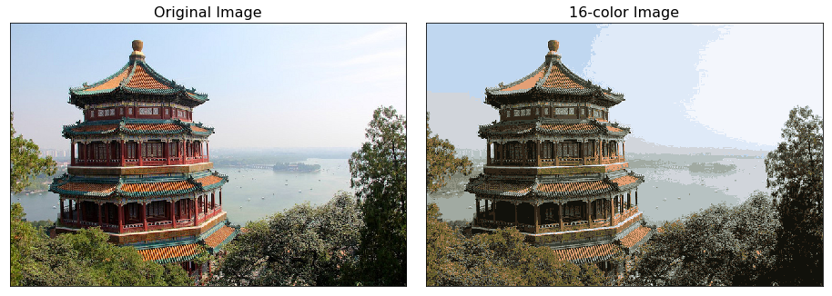

# Image Color Compression using K-Means

<p align="center">
  
</p>

This project demonstrates color compression of images using the K-Means clustering algorithm. The main script `main.py` allows you to select an image file, specify the number of colors for compression, and saves the compressed image to an `outputs` directory.

## Features

- **Image Input:** Supports PNG, JPG, JPEG, BMP, and GIF images.
- **Color Compression:** Utilizes K-Means clustering to reduce the number of distinct colors.
- **File Size Information:** Displays original and compressed image file sizes.
- **Output:** Saves the compressed image to an `outputs` directory and displays both the original and compressed images side by side.

## Requirements

- Python 3.x
- Pillow (PIL)
- NumPy
- Matplotlib
- scikit-learn

## Installation

1. Clone the repository:
   ```bash
   git clone https://github.com/KIRAN-KUMAR-K3/Image-Color-Compression-using-K-Means.git
   cd Image-Color-Compression-using-K-Means
   ```

2. Install dependencies:
   ```bash
   pip install -r requirements.txt
   ```

## Usage

1. Ensure you have images in the `images` directory.
2. Run `main.py`:
   ```bash
   python main.py
   ```
3. Follow the prompts to:
   - Enter the path to the image file.
   - Specify the number of colors for compression.
   - Save the compressed image to the `outputs` directory.
4. View the original and compressed images, as well as their file sizes.

## Example



## License

This project is licensed under the MIT License. See the [LICENSE](LICENSE) file for details.
